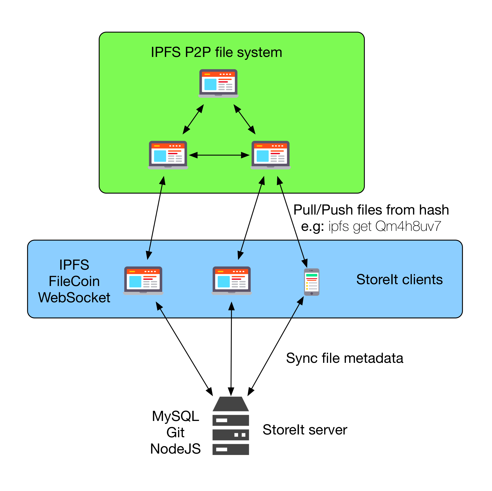

StoreIt - Stockage dans le cloud décentralisé
=============================================


Titre | Date | Sujet
------|----- | -----
2017_UD1_StoreIt.pdf | 1/5/2016 | Documentation Utilisateur

Tableau des révisions

Date | Auteur | Section(s) | commentaire
------|----- | -----
1/5/2016 | Groupe StoreIt | Toutes | Rédaction initiale

<!-- START doctoc generated TOC please keep comment here to allow auto update -->
<!-- DON'T EDIT THIS SECTION, INSTEAD RE-RUN doctoc TO UPDATE -->

- [StoreIt - Stockage dans le cloud décentralisé](#storeit---stockage-dans-le-cloud-d%C3%A9centralis%C3%A9)
- [Le serveur StoreIt](#le-serveur-storeit)
  - [Utilisation du serveur](#utilisation-du-serveur)
- [Web-App](#web-app)
  - [Login](#login)
  - [Explorateur](#explorateur)
  - [Menu contextuel](#menu-contextuel)
- [Application iOS](#application-ios)
    - [Application Android](#application-android)

<!-- END doctoc generated TOC please keep comment here to allow auto update -->

Le serveur StoreIt
==============

Le serveur est un programme en ligne de commande. Comme on peut le voir dans le schéma ci dessous, il permet la synchronisation de tous les clients IPFS.




Utilisation du serveur
----------------------

```bash
$> storeit-srv --help

  Usage: main [options]

  StoreIt server

  Options:

    -h, --help                                    output usage information
    -V, --version                                 output the version number
    -l, --log <file>                              set the logging file path
    -p, --port <port>                             set the listening port
    -a, --addr <address>                          set the listening address
    -v, --level VERBOSE|DEBUG|INFO|WARNING|ERROR  set the logging level

```

Web-App
=======

Login
-----

L'utilisateur s'authentifie au serveur via son couple identifiant/mot-de-passe


Explorateur
-----------

Une fois connecté, l'utilisateur est redirigé vers le gestionnaire de fichiers.


La sidebar présente une vue compacte de l'arborescence et le bouton `Nouveau` permet d'importer un nouveau fichier.

Menu contextuel
---------------

Le clique droit sur un fichier ouvre le menu contextuel.


Il propose les options suivantes:
* Déplacer le fichier
* Renommer le fichier
* Afficher les informations sur le fichier
* Télécharger le fichier
* Supprimer le fichier

Application iOS
===============

1. Écran de connexion


L’utilisateur dispose d’un écran de connexion pour accèder au contenu de l’application. Il peut se créer un compte s’il n’en possède pas. Il peut aussi changer son mot de passe en cas d’oublie.

2. Affichage du dossier synchronisé


Ceci est l’écran principal de l’application. Il permet de lister les fichiers et dossiers présents dans le dossier synchronisé StoreIt. L’utilisateur a alors accès à plusieurs fonctionnalités. L’affichage par défaut est en liste, mais l’utilisateur à la possibilité ses fichiers et dossiers en grille (2).

3. Importer des fichiers et organiser le dossier synchronisé

Grâce à l’icône (1), l’utilisateur peut :

* Importer des fichiers dans le dossier synchronisé StoreIt
* Réorganiser le contenu du dossier synchronisé (créer des nouveaux dossiers, déplacer des fichiers et les supprimer)


4. Menu contextuel d'un fichier ou dossier

Lorsque l’utilisateur utilise l’icône (3), un menu contextuel est alors ouvert et il peut effectué des actions sur le dossier ou fichier concerné, comme :

* Le supprimer
* L’ouvrir
* Consulter des informations relatives à ce fichier ou dossier


### Application Android

1. écran de connexion


L'utilisateur dispose d'un écran de connexion pour accéder au contenu de l'application. Il peut se créer un compte s'il n'en possède pas. Il peut aussi changer son mot de passe en cas d'oubli.

2. Affichage du dossier synchronisé


Ceci est l'écran principal de l'application. Il permet de lister les fichiers et dossiers présents dans le dossier synchronisé StoreIt. L'utilisateur a alors accès à plusieurs fonctionnalités. L'affichage par défaut est en liste, mais l'utilisateur à la possibilité ses fichiers et dossiers en grille (2).

3. Importer des fichiers et organiser le dossier synchronisé

Grâce à l'icône (1), l'utilisateur peut :

* Importer des fichiers dans le dossier synchronisé StoreIt
* Réorganiser le contenu du dossier synchronisé (créer des nouveaux dossiers, déplacer des fichiers et les supprimer)


4. Menu contextuel d'un fichier ou dossier

Lorsque l'utilisateur utilise l'icône (3), un menu contextuel est alors ouvert et il peut effectué des actions sur le dossier ou fichier concerné, comme :

* Le supprimer
* Le renommer


